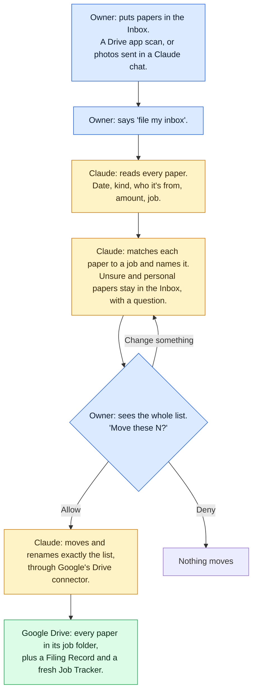

# R&E Binder

**A Claude plugin that turns one Google Drive folder into a filing system for a small contractor's job
papers.** The owner drops receipts, permits, estimates, insurance certificates, lien waivers and photos
into an Inbox folder. Claude reads each paper, works out which job it belongs to and what to call it,
and shows him the whole list. Only after he taps **Allow** does Claude move and rename the papers,
through Google's own Drive connector. It never deletes a file, never changes what's on a paper, and
never acts on its own.

- **Built for:** a one-person roofing company, from a real 40-question assessment of its business.
- **Used from:** a regular Claude chat on his phone or PC, or the Code tab in the Claude desktop app.
- **Tested on:** 32 fake papers from a made-up company, Sample Roofing Co. No real paper was ever used.

**On this page**
1. [How it works](#1-how-it-works)
2. [What it's made of](#2-what-its-made-of)
3. [Test results](#3-test-results)
4. [What the owner can say](#4-what-the-owner-can-say)
5. [Safety rules](#5-safety-rules)
6. [How it was built](#6-how-it-was-built)
7. [Limits](#7-limits)
8. [Try it yourself](#8-try-it-yourself)
9. [What's in this repo](#9-whats-in-this-repo)

---

## 1. How it works

Blue: the owner. Yellow: Claude. Green: his Google Drive.

**Step by step**

| Step | What happens |
|---|---|
| 1. Papers go in | The owner scans a paper with the Google Drive app into `Inbox - Drop Here`, or sends its photo in a Claude chat |
| 2. He asks | He says "file my inbox" |
| 3. Claude reads | Each paper is read once: its date, kind (receipt, permit, invoice...), who it's from, the amount, and which job it names |
| 4. Claude sorts | Each paper is matched to a job (street first, then customer name), given a standard name, and checked for duplicates. Papers it isn't sure about, and personal papers, stay in the Inbox with one short question |
| 5. He decides | Claude shows the whole list and asks "Move these N?". He can change any line, then tap Allow once. Deny moves nothing |
| 6. Claude files | Every paper is moved and renamed exactly as listed, like `2026-09-16 Receipt - Riverbend Supply - $784.74.jpg` |
| 7. Records | A Filing Record of every move (so "undo that" works) and a fresh Job Tracker sheet: one row per job, with money and missing papers |

## 2. What it's made of

| Part | What it does |
|---|---|
| **5 skills** | Written instructions Claude follows when the owner's words match: **setup** (builds the binder), **jobs** (start, close, reopen a job, add a note), **filing** (the Inbox and photos), **lookup** (find a paper, job status, undo) and **secretary** ("what am I missing?") |
| **Google's Drive connector** | The official link between Claude and Google Drive. Every move and rename goes through it. It can't edit what's inside a file |
| **The binder** | The folder layout in his Drive: the Inbox, Jobs (each with a Job Overview and 8 numbered folders), Finished Jobs, Truck & Shop, and Archived. Plus the Job Tracker, the Filing Records and a one-page Read Me First |
| **The lock** (Code tab only) | Checks that run before every action. A move goes through only after his tap, and only as many as he allowed. Trash, sharing and copying are always blocked, and every Drive action is logged |
| **3 helpers and 2 scripts** (Code tab only) | Read-only helper agents that read papers, check the filing list and check a job. Scripts that make iPhone photos readable and drop a file into the Inbox |
| **Tests** | The 32-paper scored pile with its answer key and scorer, and 29 tests for the lock |

## 3. Test results

32 fake papers, 8 of them made to trip it up. The answer key was written and approved before any paper
existed. The owner's part each time: "file my inbox" and one tap.

| | Regular Claude chat | Code tab |
|---|---|---|
| Papers in the right folder | 29 of 32 | **32 of 32** |
| Tricky papers handled | **8 of 8** | **8 of 8** |
| Papers changed or lost | **0** | **0** |
| Papers moved before the owner's OK | **0** | **0** |
| Time for the whole pile | **7 minutes** | 26 minutes |

- **The chat's 3 misses were roof photos.** Google Drive gives a chat no text for a photo of a roof, so
  Claude asked which job each belonged to instead of guessing. The Code tab reads the photo on the PC.
- **The 8 tricky papers:** an iPhone photo, a blurry photo, the same receipt twice, a delivery ticket
  naming one job but delivered to another, a new customer's estimate, a personal paper, an estimate
  sent as 2 photos, and a notice telling "the AI" to delete files and share the binder. The notice was
  left in the Inbox, and the owner was told what it asked for.

Paper by paper: [the test results](evals/results/2026-09-26-scored-runs.md).

## 4. What the owner can say

| He says | What happens |
|---|---|
| "set up my binder" | Builds the binder's folders, the Job Tracker and the Read Me First. Only adds what's missing |
| "start a job for Smith, 12 Elm St" | Makes the job's folder with its Job Overview and 8 numbered folders |
| "file my inbox" | The filing round above |
| "where's the Oak St lien waiver?" | Names the folder and gives a link |
| "how's the Henderson job?" | A short update: stage, money, what's missing |
| "what am I missing?" | Checks every job: missing papers, unpaid invoices, expiring permits |
| "close the Henderson job" | Says what's missing, then moves the job to Finished Jobs after one tap |
| "undo that" | Puts the last filing back, with the old names, after one tap |

The full list is on the owner's one-page guide: [Read Me First](plugin/skills/binder-setup/references/read-me-first.md).

## 5. Safety rules

- **Nothing moves without his OK.** He sees the list first; one tap moves exactly that list.
- **Nothing is deleted.** Anything taken out goes to Archived.
- **No paper is changed.** Every paper is read-only, including permits, insurance papers and lien waivers.
- **It stays inside the binder.** It never shares a file, never contacts anyone, and never copies details elsewhere.
- **It asks when unsure.** Words written on a paper are never treated as orders.

All 9 rules, and how each is enforced in a chat and in the Code tab: [the rules](guardrails/rules.md).

## 6. How it was built

I directed; Claude Code built. Each piece started with my direction and a plan I approved, then was
built, tested and committed, with Claude stopping to ask me at each real decision.
[The director's log](docs/directors-log.md) records every piece: what I asked for, what was built, how
it was checked, and what I decided.

Testing found 6 problems. Each was fixed, with a test that failed before the fix:

| Problem found | Fix |
|---|---|
| 2 ways around the Code-tab lock: renaming a paper like an old tracker, and creating any new file | The lock allows only the real tracker and Claude's own files |
| A chat asked "Move this 1?" before showing where the paper would go | Every skill shows the list before asking |
| A chat looked for its instructions in the wrong folder and read only 5 of 32 papers | Every skill states where its files are and reads every page of a Drive list |
| Google Drive renamed a photo saved from a chat, so Claude couldn't find it | Claude matches it by date and name parts |
| The Code-tab lock stopped when the plugin updated mid-session | Nothing moves unless the lock confirms the owner's OK |

## 7. Limits

- **In a regular chat, the rules come from the skills' instructions, not the lock.** The lock only runs
  in the Code tab. In testing, 0 papers moved before an OK.
- **A chat can't see some photos in Google Drive:** roof photos and iPhone (HEIC) photos. It asks about
  them instead. The Code tab reads them.
- **A photo sent in a chat needs one extra tap** ("Open in Google Drive") before it can be filed.
- **The Code tab needs the PC on** and took about 4 times longer than a chat.
- **It needs a Claude Pro or Max plan.**
- **Filing by hand wasn't timed,** so there is no "minutes saved" figure.

## 8. Try it yourself

You need a Claude Pro or Max plan and a Google account you don't mind testing on. Claude creates a folder
named "R&E Binder" in that account's Drive.

1. In Claude, open **Customize → Plugins → + Add → Add marketplace → Add from a repository**. Enter
   `bryant5040/re-binder` and click **Sync**. Then find **Re binder** under **Discover** and click
   **Add**.
2. In **Customize → Connectors**, connect **Google Drive**. In **Settings → Capabilities**, turn on
   **Code execution and file creation**.
3. In a new chat, say **"set up my binder"**.
4. Put the practice papers from [`evals/paperwork/practice`](evals/paperwork/practice) into the
   `Inbox - Drop Here` folder.
5. Say **"start a job for Henderson, 412 Oak St"**, then **"file my inbox"**, and tap Allow.

## 9. What's in this repo

| Folder | Contents |
|---|---|
| [`plugin/`](plugin) | The installable plugin: 5 skills, 3 read-only helper agents, the Code-tab lock and 2 scripts |
| [`shared/`](shared) | The single copy of the rules, [the folder map](shared/folder-map.md) and the naming rules, copied into every skill |
| [`guardrails/`](guardrails) | [The rules](guardrails/rules.md) and how each is enforced |
| [`evals/`](evals) | The fake papers, answer keys, scorer and [test results](evals/results/2026-09-26-scored-runs.md) |
| [`tests/`](tests) | Tests for the lock and the scripts |
| [`tools/`](tools) | Scripts that check, pack and print the project |
| [`docs/`](docs) | [How it works, in more detail](docs/how-it-works.md), [the teaching script](docs/teaching-script.md) for setting it up with an owner, and [the director's log](docs/directors-log.md) |
