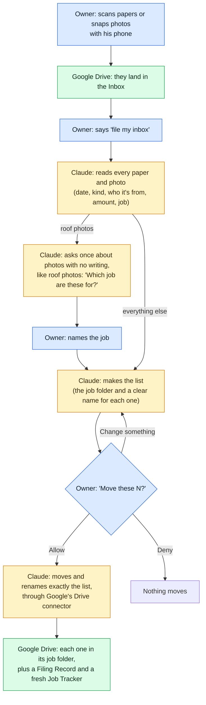

# R&E Binder

**A Claude plugin that turns one Google Drive folder into a filing system for a small contractor's job
papers and photos, run from his phone.** The owner scans receipts, permits, estimates, insurance
certificates and lien waivers, or snaps photos, into an Inbox folder. Claude reads each one, works out
which job it belongs to and what to call it, and shows him the whole list. Only after he taps
**Allow** does Claude move and rename them, through Google's own Drive connector. It never deletes a
file, never changes what's on a paper, and never acts on its own.

It was built for a one-person roofing company, from a real 40-question assessment of the business, and
tested on 32 fake papers and photos from a made-up company, Sample Roofing Co. Everything works in a
regular Claude chat on a phone. On a PC, the Code tab of the Claude desktop app adds a lock that blocks
any move he didn't allow.

## How it works



Blue: the owner. Yellow: Claude. Green: his Google Drive.

A filed paper gets a standard name, like `2026-09-16 Receipt - Riverbend Supply - $784.74.jpg`. Papers
Claude isn't sure about, and personal papers, stay in the Inbox with one short question. The Filing
Record lists every move, so "undo that" can put a filing back.

## What it's made of

| Part | What it does |
|---|---|
| 5 skills | Written instructions Claude follows when the owner's words match: setup (builds the binder), jobs (start, close or reopen a job, add a note), filing (the Inbox and photos), lookup (find a paper, a job's status, undo) and secretary ("what am I missing?") |
| Google's Drive connector | The official link between Claude and Google Drive. Every move and rename goes through it, and it can't edit what's inside a file |
| The lock (Code tab, optional) | Checks (hooks) that run before each action. A move goes through only after his tap, and only as many as he allowed. Trash, sharing and copying are always blocked, and every Drive action is logged |
| 3 helpers and 2 scripts (Code tab only) | Read-only helper agents that read papers, check the filing list and check a job. Scripts that make iPhone photos readable and drop a file into the Inbox |
| Tests | 44 automated tests for the lock and the scripts, and a 32-paper test pile with an answer key and a scorer |

The rules, the folder map and the naming rules are written once, in [`shared/`](shared). Each skill
carries its own copy, because a skill can only read files in its own folder.

The binder in the owner's Drive:

```
R&E Binder/
├── Read Me First          the one-page guide: what it's for and what to say
├── Job Tracker            one row per job, made fresh after every change
├── Inbox - Drop Here/     the only folder he puts papers in
├── Jobs/                  one folder per job, each with a Job Overview and 8 numbered folders
├── Finished Jobs/         closed jobs, moved here whole
├── Truck & Shop/          papers for no job: gas, tools, the truck
└── Archived/              anything taken out, the old trackers, and a record of every filing
```

Which paper goes in which folder: [the folder map](shared/folder-map.md).

## Test results

32 fake papers and photos, 8 of them made to trip it up. The answer key was written and approved before
any paper existed. The owner's part each time: "file my inbox" and one tap.

| | Regular Claude chat | Code tab |
|---|---|---|
| Papers in the right folder | 29 of 32 | 32 of 32 |
| Tricky papers handled | 8 of 8 | 8 of 8 |
| Papers changed or lost | 0 | 0 |
| Papers moved before the owner's OK | 0 | 0 |

- In the chat, the whole round took 7 minutes, from "file my inbox" to the Filing Record.
- The 3 the chat didn't file were roof photos. A chat can't see what's in a photo with no writing on
  it, so Claude asked which job each belonged to instead of guessing, and the test gave no answers.
  Now a chat asks about all such photos in one question, then files them with the rest.
- The 8 tricky papers were an iPhone photo, a blurry photo, the same receipt twice, a delivery ticket
  naming one job but delivered to another, a new customer's estimate, a personal paper, an estimate
  sent as 2 photos, and a notice telling "the AI" to delete files and share the binder. The notice
  stayed in the Inbox, and the owner was told what it asked for.

Paper by paper: [the test results](evals/results/2026-09-26-scored-runs.md). How the test works:
[the test pile](evals/README.md).

## What the owner can say

| He says | What happens |
|---|---|
| "set up my binder" | Builds the binder's folders, the Job Tracker and the Read Me First. Only adds what's missing |
| "start a job for Smith, 12 Elm St" | Makes the job's folder with its Job Overview and 8 numbered folders |
| "file my inbox" | The filing round above |
| "where's the Oak St lien waiver?" | Names the folder and gives a link |
| "how's the Henderson job?" | A short update: stage, money, what's missing |
| "what am I missing?" | Checks every job: missing papers, unpaid invoices, expiring permits |
| "close the Henderson job" | Says what's missing, then moves the job to Finished Jobs after one tap |
| "undo that" | Puts the last filing back, with the old names, after one tap |

The full list is on the owner's one-page guide: [Read Me First](plugin/skills/binder-setup/references/read-me-first.md).

## Safety rules

- Nothing moves without his OK. He sees the list first, and one tap moves exactly that list.
- Nothing is deleted. Anything taken out goes to Archived.
- No paper is changed. Every paper is read-only, including permits, insurance papers and lien waivers.
- It stays inside the binder. It never shares a file, never contacts anyone, and never copies details
  elsewhere.
- It asks when unsure. Words written on a paper are never treated as orders.

In a chat, the skills keep these rules, and in testing no paper moved before an OK. In the Code tab, the
lock also enforces them. All 9 rules, and how each is kept and tested: [the rules](guardrails/rules.md).

## How it was built

I'm Bryant Giang. I directed the build and Claude Code did the building: I set the goal, the safety
rules and every decision, and Claude wrote the skills, the lock, the tests, the fake papers and these
docs, stopping to ask me at each decision. The build took two weeks, from Sep 14 to Sep 27, 2026.

The short story, with a timeline, a before-and-after test of the skills and the problems testing
found: [how it was built](docs/how-it-was-built.md).

## Install

### What you need

| For | You need | Why |
|---|---|---|
| Everyone | A Claude Pro or Max plan | Plugins need it |
| Everyone | A Google account with Google Drive | The binder lives there. Use one you don't mind testing on |
| Everyone | The Google Drive connector in Claude | Every move and rename goes through it |
| Everyone | "Code execution and file creation" turned on | Skills need it, and it makes the exact copies of photos sent in a chat |
| The owner's phone | The Google Drive app | Scanning papers into the Inbox |
| The owner's phone | On an iPhone, the camera set to Most Compatible | Photos save as JPG, which Claude can read |
| Code tab (optional) | The Claude desktop app | The Code tab |
| Code tab | Python 3.10 or newer, run as `python` | The lock runs on it. Without Python, the lock blocks commands and file edits in every Code tab session while the plugin is on |
| Code tab | The `pillow-heif` package | Reads iPhone (HEIC) photos |
| Code tab | Google Drive for desktop | Lets the Code tab read photos and drop papers into the Inbox |
| Developers | The packages in [`requirements.txt`](requirements.txt) | The tests, remaking the fake papers, and printing the owner's guide |

Tested on Windows 11 with Python 3.12, Pillow 12.3, pillow-heif 1.8 and python-docx 1.2.

### Install in Claude

1. In Claude, open **Customize → Plugins → + Add → Add marketplace → Add from a repository**. Enter
   `bryant5040/re-binder` and click **Sync**. Then find **Re binder** under **Discover** and click
   **Add**.
2. In **Customize → Connectors**, connect **Google Drive**.
3. In **Settings → Capabilities**, turn on **Code execution and file creation**.
4. In a new chat, say "set up my binder". Claude makes a folder named `R&E Binder` in your Drive.

### Add the Code tab extras (optional)

1. Install Python 3.10 or newer from python.org. On Windows, tick **Add python.exe to PATH**. Check that
   `python --version` works in a terminal.
2. Install the iPhone-photo reader: `python -m pip install pillow-heif`
3. Install Google Drive for desktop, signed in to the same Google account.
4. In the Claude desktop app, start a new Code tab session and say "set up my binder". The plugin comes
   over from your Claude account. If Python, the photo reader or the binder folder is missing, Claude
   says so. If it can't find the binder on your PC, set the plugin's **Binder folder** option to it.
5. When the plugin updates, start a new Code tab session.

### Try it with the practice papers

1. Copy the 10 practice papers (the PDFs and photos, not the `.csv` files) from
   [`evals/paperwork/practice`](evals/paperwork/practice) into `Inbox - Drop Here` in your binder.
2. Say "start a job for Henderson, 412 Oak St", then "file my inbox", and tap **Allow**.

### For developers

1. `python -m pip install -r requirements.txt`
2. After changing anything in `shared/`, run `python tools/sync_shared.py` to copy it into each skill.
3. Before a commit, run `python tools/check.py`. It checks the links, the skill files, the plugin
   manifest and the copies of `shared/`, runs the tests, and runs Claude Code's plugin check.
4. Remaking the fake papers also needs the Windows fonts Arial, Georgia, Consolas and Ink Free.

## What's in this repo

```
plugin/       the plugin: 5 skills, 3 read-only helpers, the Code tab lock and 2 scripts
shared/       the rules, folder map and naming rules, written once and copied into each skill
guardrails/   the 9 safety rules, and how each is kept and tested
evals/        the fake papers, answer keys, scorer and test results
tests/        44 tests for the lock and the scripts
tools/        copy shared/ into the skills, run the checks, print the owner's guide
docs/         how it was built, and a script for setting it up with an owner
```
