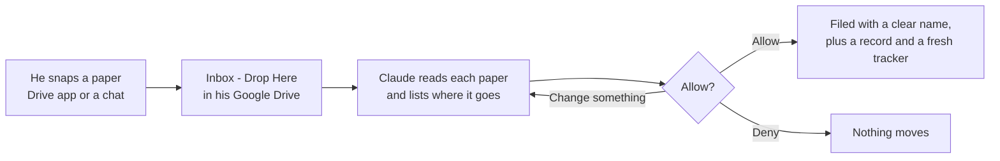

# How it works

## In one minute

A roofing contractor's papers (receipts, permits, insurance certificates, lien waivers) end up
everywhere. The binder gives him one folder in Google Drive to put them in.

He tells Claude "file my inbox". Claude reads each paper and lists where it goes. He changes anything
he wants, taps **Allow**, and every paper moves into the right job folder with a clear name. Nothing
moves without his OK, and nothing is ever deleted.

**He only does three things:** put papers in, ask Claude, and tap Allow or Deny.

## The picture



Claude moves papers with Google Drive's own connector, the built-in link between Claude and Google
Drive. Everything else is what this repo adds: the skills tell Claude how to file, and the rules and
the lock stop it doing anything risky.

## Where he uses it

| | A regular Claude chat (most of the time) | The Code tab (sometimes) |
|---|---|---|
| **Where** | The Claude app, on his phone or PC | The Claude desktop app, on his PC |
| **How papers get in** | The Drive app's Inbox, or photos sent in the chat | The Inbox, or a file dropped into the chat |
| **What keeps it safe** | The skills: the list first, then his tap | The same, plus a lock that blocks any move he didn't allow |
| **Photos Drive can't read** (roof photos, iPhone HEIC) | Claude asks which job, or asks for the photo in the chat | Claude reads them on the PC |
| **The test pile of 32** | 29 right, in 7 minutes | 32 right, in 26 minutes |

## The 5 skills

A skill is a set of written instructions Claude follows when the owner's words match it.

| Skill | He says | What happens |
|---|---|---|
| `binder-setup` | "set up my binder", "how does my binder work?" | Makes the binder's folders, the Read Me First and the Job Tracker. Only adds what's missing; never moves anything |
| `job-organizer` | "start a job for Smith, 12 Elm St", "close the Henderson job", "reopen Patel", "add a note to Henderson: ..." | Makes a job's 8 folders. Closing says what's missing first, then asks. Notes are new dated Google Docs |
| `binder-filing` | "file my inbox", "file these", "put the permit in Martinez" | Reads each paper once, lists where it goes, waits for one tap, files the list exactly, then writes a record and a fresh tracker |
| `binder-lookup` | "where's the Oak St lien waiver?", "how's the Henderson job?", "undo that" | Finds a paper with a link, gives a short job update, or puts the last filing back after one tap |
| `binder-secretary` | "what am I missing?" | Checks every job against the checklist: missing papers, money reminders, dates. Only looks, never changes anything |

All five share one set of rules, kept in [`shared/`](../shared) and copied into each skill.

## The Code tab extras

- **The lock:** small checks (hooks) that run before every action in the Code tab.
  - A move or rename goes through only after his tap, and only as many as he allowed, for 15 minutes.
  - Trash, share and copy are always blocked. New files can only be folders and Claude's own Docs and
    Sheets.
  - Claude can't write into the binder's folder on the PC. Helper agents can only read.
  - Every Google Drive action goes into a log.
  - If the lock isn't running, the skills move nothing and ask him to start a new session.
- **3 helper agents,** extra copies of Claude that only read: a paper reader, a filing checker and a
  job checker.
- **2 scripts:** one makes iPhone photos readable, and one drops a file from the chat into the Inbox.

## The binder

```
R&E Binder/
├── Read Me First          the one-page guide: what it's for and what to say
├── Job Tracker            one row per job, made fresh after every change
├── Inbox - Drop Here/     the only folder he puts papers in
├── Jobs/                  one folder per job, each with a Job Overview and 8 numbered folders
├── Finished Jobs/         closed jobs, moved here whole
├── Truck & Shop/          papers for no job: gas, tools, the truck
└── Archived/              anything taken out, the old trackers, and a record of every filing
```

The full map, and which paper goes in which folder: [the folder map](../shared/folder-map.md).

## Setting it up for an owner

| # | Step | Who |
|---|---|---|
| 1 | A Claude Pro or Max plan, and the Claude app on his phone and PC | Whoever sets it up |
| 2 | The Google Drive app on his phone. On an iPhone, Settings → Camera → Formats → **Most Compatible**, so photos save as JPG | Whoever sets it up |
| 3 | In Claude, connect **Google Drive**, and add this plugin from GitHub (Customize → Plugins) | Whoever sets it up, with his OK |
| 4 | **Code tab only (optional):** Python 3 and the iPhone-photo reader (`pip install pillow-heif`), then Google Drive for desktop | Whoever sets it up |
| 5 | He says **"set up my binder"** | The owner |

## Limits

The limits, and the test results, are in [the README](../README.md#7-limits).
How each piece was built, block by block: [the director's log](directors-log.md).
